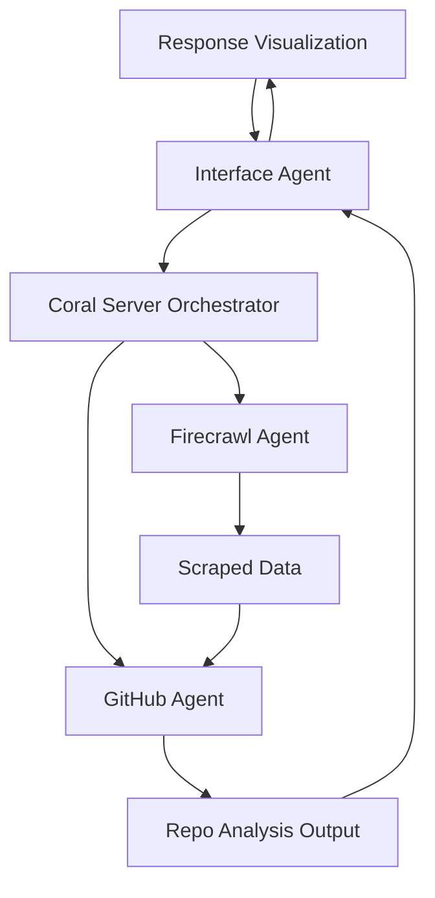

## InnoAgent-Hub Architecture

### High-Level Agent Flow

### Layers

- **Agents (src/agents/)**

  - `interface`: Handles user-facing prompts and synthesizes responses.
  - `github`: Analyzes repositories, issues, and code structures.
  - `firecrawl`: Performs web scraping and research.
  - `community` (planned): Polls GitHub issues and other sources for crowdsourced prompts.

- **Orchestration (backend/orchestrator/)**

  - Coral Server Java service (submodule in `backend/orchestrator/coral-server`).
  - `application.yaml` defines available agents, their runtimes, and options.
  - `bootstrap.py` prepares the Python environment and paths for local agents.

- **Presentation (frontend/studio/ & InnoAgent-Hub/)**
  - Coral Studio (in `frontend/studio/coral-studio`) for visualizing sessions and threads.
  - TypeScript/Next.js UI (in `InnoAgent-Hub/`) for embedding or extending the experience.

### Technology Stack

- **Backend / Orchestration**

  - Java 21 (Coral Server)
  - YAML configuration
  - Python 3.10+ agents

- **Frontend**
  - Next.js + React + TypeScript
  - TailwindCSS
  - Convex (data) and Clerk (auth) in the UI app

### Extension Points

- **New Agents**

  - Add a new package under `src/agents/<name>/`.
  - Register it in `backend/orchestrator/application.yaml` and `config/registry.toml`.

- **Custom Tools**

  - Implement new HTTP tools or MCP tools.
  - Wire them into Coral Studio via registry and config.

- **Community Contributions**
  - New demo flows under `demos/`.
  - Additional dashboards or visualizations in `frontend/studio/extensions/`.
